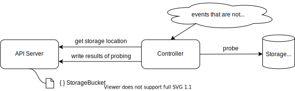
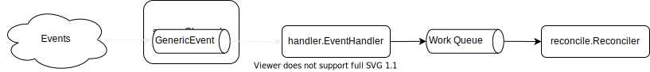

これはなに
---
Kubernetesクラスター外で起きたイベントを起点にReconcileをおこなうカスタムコントローラーの書き方を調べたので、その内容を書きます。
これができると、Kubernetesのカスタムリソースでクラスターの外にあるシステムを管理する、そんなコントローラーを作ることができます。素敵！

> 📘【note】
> この記事は[Kubernetes2 Advent Calendar 2021](https://qiita.com/advent-calendar/2021/kubernetes)の3日目です。
> 昨日は@makocchiさんの[Advanced StatefulSet を使ってみよう](https://makocchi.medium.com/how-to-use-advanced-statefulset-ja-779ca00e2dda)でした。

<br>

目次
---

- 例えばこんなものを作りたい
- controller-runtimeのWatches()の話
- 実装していく！
    1. Reconcileメソッド
    2. 定期的にイベントを発生させるRunnable構造体
    3. コントローラーのセットアップ
    4. コントローラーをManagerに登録する
- まとめ


例えばこんなものを作りたい
---
本エントリでは、簡単な例として以下のようなコントローラーを題材にします。

- Kubernetesクラスターの外にあるオブジェクトストレージのバケットを、カスタムリソース"StorageBucket"で定義する
- カスタムリソースで定義されたStorageBucketに対してヘルスチェックを定期的に行い、結果をStorageBucketリソースのStatusフィールドに記録する



これを実現するため、「一定時間が経過した」というイベントを起点にカスタムコントローラーのReconcileを実行する、という実装をしてみます。


controller-runtimeのWatches()の話
---
controller-runtimeの[builderパッケージ](https://pkg.go.dev/sigs.k8s.io/controller-runtime@v0.10.3/pkg/builder)には、コントローラーのBuilderユーティリティが用意されていて、これによって所定のリソースを監視対象とするコントローラーを作ることができます。

例えば、[builder.For()](https://pkg.go.dev/sigs.k8s.io/controller-runtime@v0.10.3/pkg/builder#Builder.For), [builder.Owns()](https://pkg.go.dev/sigs.k8s.io/controller-runtime@v0.10.3/pkg/builder#Builder.Owns) を以下のように実行すると、ReplicaSetとPodリソースに何らかのイベントがあったときにReconcileがトリガーされることになります。

_※ Controller Runtimeの[コード例](https://pkg.go.dev/sigs.k8s.io/controller-runtime@v0.10.3/pkg/builder#example-Builder)より_

```go
    // ...(snip)...
	err = builder.
		ControllerManagedBy(mgr).  // Create the ControllerManagedBy
		For(&appsv1.ReplicaSet{}). // ReplicaSet is the Application API
		Owns(&corev1.Pod{}).       // ReplicaSet owns Pods created by it
		Complete(&ReplicaSetReconciler{})
	if err != nil {
		log.Error(err, "could not create controller")
		os.Exit(1)
	}
    // ...(snip)...
```

ですが、これはあくまでKubernetesリソースに起きたイベントを起点にReconcileをトリガーするもので、それ以外のイベント、このエントリの例で言えば「一定時間が経過した」ことをきっかけにReconcileを実行することはできません。

そんなときのために、builderパッケージには[builder.Watches()](https://pkg.go.dev/sigs.k8s.io/controller-runtime@v0.10.3/pkg/builder#Builder.Watches)メソッドが用意されています。
Watches()メソッドを使うと、とあるチャネルにオブジェクトをエンキューすることを起点にしてReconcileを実行させることができます。そのチャネルに一定時間ごとにオブジェクトを投入してあげれば、今回やりたいことができるわけです。

Watches()メソッドのシグニチャは以下のようになっています。

```go
func (blder *Builder) Watches(src source.Source, eventhandler handler.EventHandler, opts ...WatchesOption) *Builder
```

第1, 第2引数が本エントリで重要な項目ですので、以下にそれぞれの説明を記します。

- source.Source:
    - Reconcileの起点となるイベントを供給するオブジェクトです
    - [soucrce.Channel]()は、このインタフェースを実装した構造体で、event.GenericEventのチャネルを内包しています。このチャネルにevent.GenericEventを投入することがイベントの起点となります
- handler.EventHandler:
    - event.GenericEventのチャネルから取り出したイベントを加工してReconcileの入力を作るハンドラです
    - GenericEventには任意のKubernetesオブジェクト含めることができます。EventHandlerでは、これを使って関連するオブジェクトをReconcileに入力として渡したり、Reconcileが要/不要を判定してスルーしたりといったことができます

GenericEventからReconcileに至るまでの大まかな流れは以下のようになります。



それでは、Watches()を利用して、定期的にReconcileを行うコントローラーを実装していきます。

<br>

実装していく！
---
それでは、実装例を紹介していきます。

> 📘【note】
> 以降、kubebuilderで生成したコントローラーの雛形をベースに説明していきます。まだkubebuilderに触ったことがないという方は、以下のいずれかのチュートリアルをやっておくことをおすすめします。
> - [つくって学ぶKubebuilder](https://zoetrope.github.io/kubebuilder-training/)
> - [The Kuberbuilder Book: Quick Start](https://book.kubebuilder.io/quick-start.html)

### Reconcileメソッド
Reconcileメソッドは、コントローラーが実行するReconcile処理の内容を実装します。

本エントリの例では、第2引数の ctrl.Request にStorageBucketリソースの情報が入ってくる想定です。
受け取ったStorageBucketリソースに対応する実際のストレージに対して、行いたいチェック処理を実装します。

```go
func (c *Controller) Reconcile(ctx context.Context, req ctrl.Request) (ctrl.Result, error) {
	var storageBucket myapiv1.StorageBucket
	err := c.Client.Get(ctx, req.NamespacedName, &storageBucket)
	if err != nil {
		return ctrl.Result{}, client.IgnoreNotFound(err)
	}

    // ここでバケットのチェックをして、カスタムリソースのStatusフィールドを更新するなどする

	return ctrl.Result{}, nil
}
```

カスタムコントローラーの開発経験がある方ですと、ここは通常のカスタムコントローラーと大差ないことが分かると思います。

### 定期的にイベントを発生させるRunnable構造体
一定時間が経過したことを持ってイベントを発生させる構造体を実装します。
「イベントを発生させる」とは、event.GenericEventチャネルにオブジェクトを格納することに相当します。

ここではtickerという名前で、Start()とNeedLeaderElection()という2つのメソッドを実装した構造体を作成しています。

```go
type ticker struct {
	events chan event.GenericEvent

	interval time.Duration
}

// (1)
func (t *ticker) Start(ctx context.Context) error {
	ticker := time.NewTicker(t.interval)
	defer ticker.Stop()

	for {
		select {
		case <-ctx.Done():
			return nil
		case <-ticker.C:
			t.events <- event.GenericEvent{}
		}
	}
}

// (2)
func (t *ticker) NeedLeaderElection() bool {
	return true
}
```

- (1)
    - Start()で定期的にevent.GenericEventチャネルにイベントを格納します
    - この例では空のGenericEventをエンキューしています。一定時間が経過したことがイベントして知らせられれば良いので、今回はこれで十分です

- (2)
    - NeedLeaderElectionについては後で説明します。

Start()、NeedLeaderElection()という2つのメソッドは、controller-runtimeのmanager.Runnableインターフェースで定義されているメソッドです（tickerはmanager.Runnableの実装になっている）。
manager.Runnableを実装しておいてmanager.Managerに渡すことで、tickerの安全な起動停止、LeaderElectionの制御をmanager.Managerに任せることができます。

Start()メソッドの実装においては、以下のような動作を守る必要があることに注意してください。

- 呼び出し後にブロックする
- 引数に受け取っているcontextが終了したときに、ブロックを抜けるようにする

NeedLeaderElection()は、LeaderElectionの制御の対象にするかどうかを決めるメソッドです。カスタムコントローラーを複数Podに冗長化してデプロイするときに、このRunnableが各Podで同時に動作して欲しくない場合、trueを返すようにします。

> 📘【note】
> LeaderElectionについては@ponde_mさんがとてもわかりやすい記事を書いてくださっているので、詳細はそちらを参照ください。
> - [Kubernetes Leader Election in Depth](https://d-kuro.github.io/post/kubernetes-leader-election/)

### コントローラーのセットアップ
SetupWithManagerメソッドは、kubebuilderでコントローラーの雛形を出力したときに作られるもので、本エントリでもそれに沿って実装を進めます。
このメソッドでは、コントローラーのインスタンスを生成してManagerに登録する処理を実装します。

Wathes()メソッドに与える引数であるsourceとhandlerを準備した上で、Watches()メソッドを含めたbuilderユーティリティを使ってコントローラーのインスタンスを作成します。
また、定期的にイベントを発行するRunnable構造体も準備します（Runnable構造体については後述します）。

```go
func (c *Controller) SetupWithManager(ctx context.Context, mgr ctrl.Manager) error {
    // (1)
	events := make(chan event.GenericEvent)
	source := source.Channel{
		Source:         events,
		DestBufferSize: 0,
	}

    // (2)
	err := mgr.Add(&ticker{
		events:   events,
		interval: c.ProbeInterval,
	})
	if err != nil {
		return err
	}

    // (3)
	handler := handler.EnqueueRequestsFromMapFunc(func(object client.Object) []reconcile.Request {
		storageBuckets := phalanksv1alpha1.StorageBucketList{}
		mgr.GetCache().List(ctx, &storageBuckets)

		var requests []reconcile.Request
		for _, storageBucket := range storageBuckets.Items {
			requests = append(requests, reconcile.Request{
				NamespacedName: types.NamespacedName{
					Name:      storageBucket.Name,
					Namespace: storageBucket.Namespace,
				},
			})
		}

		return requests
	})

    // (4)
	return ctrl.NewControllerManagedBy(mgr).
		For(&phalanksv1alpha1.StorageBucket{}).
		Watches(&source, handler).
		Complete(c)
}
```

- (1)
    - event.GenericEventのチャネルを作ります
- (2)
    - イベントチャネルに定期的にイベントをエンキューする、Runnable構造体を作ります
    - Runnable構造体は、Manager.Add()メソッドによってManagerに登録し、起動停止の管理をManagerに任せるようにしています（詳細は後述）
- (3)
    - イベントチャネルから取得したイベントを、Reconcileの入力(reconcile.Request)に変換するハンドラを実装します
    - 若干大雑把な実装ですが、API Server上のすべてのStorageBucketリソースに対応するreconcile.Requestを作っています。こうすることで定期的に全StorageBucketに対してReconcileが実行される動作となります
- (4)
    - builderユーティリティを使ってコントローラーの実態を作ります。Watches（）メソッドで、source, handlerを引数に与えています

### コントローラーをManagerに登録する
あとはmainコンポーネントでSetupWithManagerを呼び出せば、定期的にReconcileが走るコントローラーが動作します。
このあたりは通常のカスタムコントローラーと同様ですので、説明は省略します。

実装例の紹介は以上です。お疲れさまでした！

まとめ
---
本エントリでは、「一定時間が経過した」ということを起点にReconcileを実行するカスタムコントローラーを例として、Kuberentesクラスター外のイベントと連携するカスタムコントローラーの作り方を紹介しました。

カスタムコントローラー開発、やっていきましょう！
