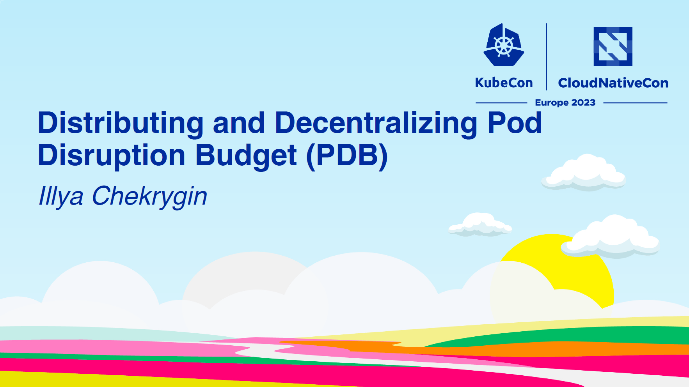
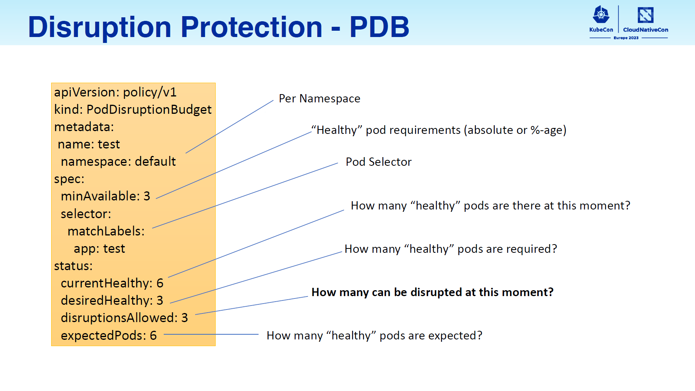
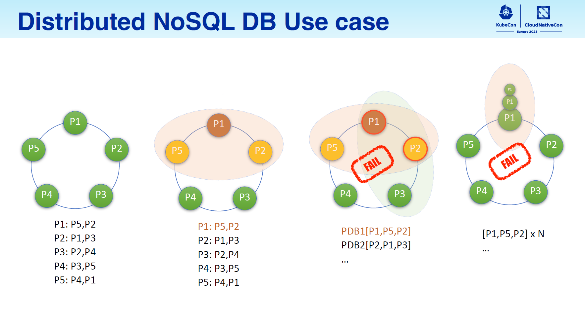
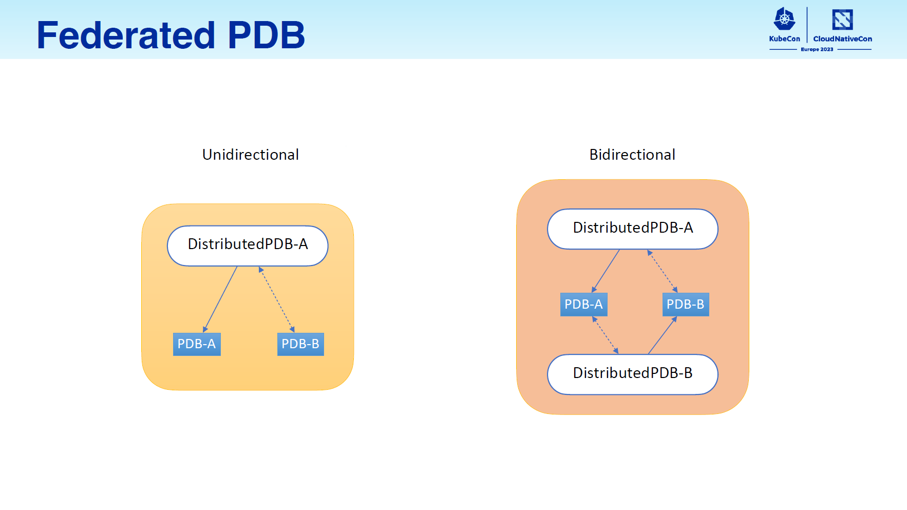
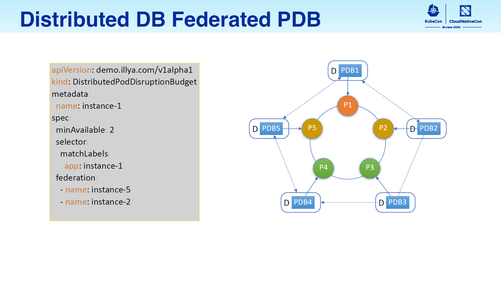
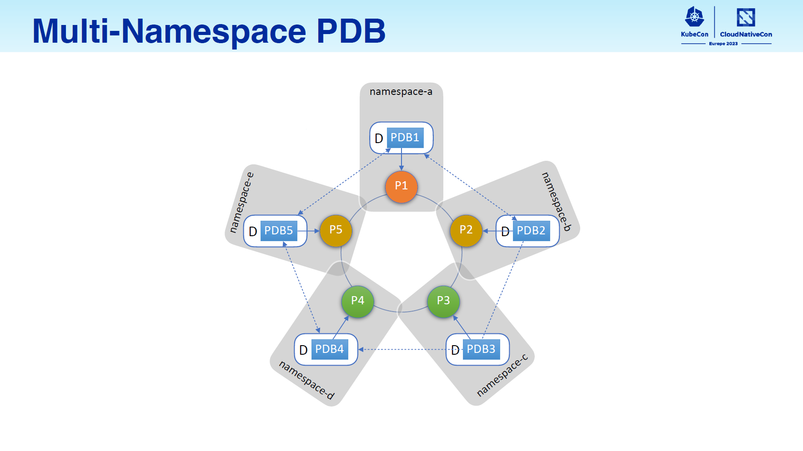
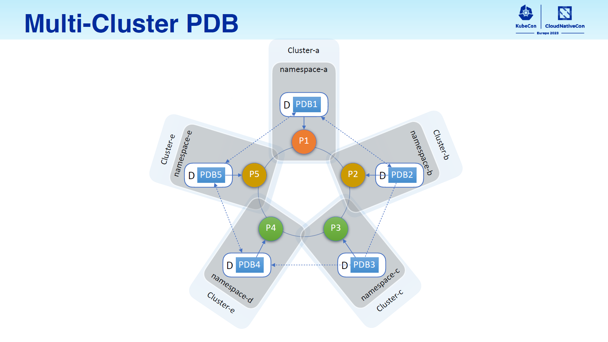

これはなに
---

これは、[Kubernetes MeetUp Tokyo #58 - KubeCon EU 2023 Recap](https://k8sjp.connpass.com/event/282273/)向けの発表資料として作成した記事です。
AppleのエンジニアであるIllya Chekrygin([Github](https://github.com/ichekrygin))さんによる、「Distributing and Decentralizing Pod Disruption Budget (PDB)」の発表内容を紹介します。

- [Sched](https://sched.co/1HyVE)
- [発表スライド](https://static.sched.com/hosted_files/kccnceu2023/08/Final%20-%20KubeCon%20%2B%20CloudNativeCon%20EU23%20Optional%20PPT.pdf)
- [YouTubeアーカイブ](https://youtu.be/2IPf_AyKSsU)

イントロダクション
---

### 発表の要点まとめ

- Kubernetes標準のPod Disruption Budget(PDB)ではカバーできないユースケースがあって困っていた
    - CassandraクラスターをKubernetes上にデプロイして、PDBで保護したいケース
    - 1つのPodに対して複数のPDBを適用することができない
- Distributed PDBというカスタムリソース&コントローラーを開発して解決した
- クラスターを跨いでPDBを効かせるということも可能でアツい

### このセッションを聴いた個人的なモチベーション

- 普段マルチクラスタなKubernetes環境を運用しており、クラスタを跨いでいい感じにリソースを制御するという技術が気になった（将来役に立つかも）

:::message
（宣伝）
以下の記事で、弊チームとZ Labで開発、運用しているマルチクラスタなプラットフォームをご紹介しています 🙇
- [ヤフーにおけるKubernetesを活用したPlatform Engineeringの取り組み](https://techblog.yahoo.co.jp/entry/2023052230423347/)
:::

セッション解説
---
ここからはセッションの中身を、かいつまんで紹介します。

### Pod Disruption Budget(PDB)ってこんなやつ
まずはPDBの簡単な復讐。

- PDBはNamespce Scopedなリソース
- `maxUnavailable`または`minAvailable`フィールドで、`selector`で選択されたPodのうち同時にevictされてもいい数を指定する
-

### 標準のPDBではカバーできないユースケース

### Federated PDBっていうのを考えてみた

### 実装はこんな感じになってた

### 所感

まとめ
---

おまけ
---
