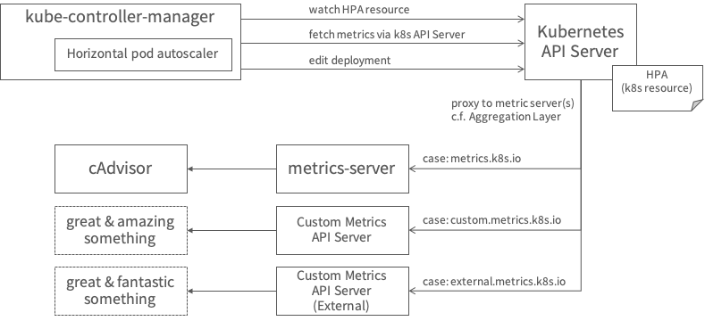

アルパカでもわかる Horizontal Pod Autoscaler
===

目次
---

1. 水平オートスケーリングの一般論
2. Kubernetesにおける水平オートスケーリング
3. 検証してみた


1 . オートスケーリングの一般論
---
オートスケーリングについての一般論は、[Chenhao Qu らの論文](https://dl.acm.org/doi/abs/10.1145/3148149)に詳しい。以下、これに基づいて全体像を整理する。

### 1-x. MAPEループ
オートスケーリングの一連の挙動は大きく4つのフェーズに分けることができ、これらのフェーズが繰り返し実行されることによって実現される。

1. Monitoring
2. Analysis
3. Planning
4. Execution


### 1-x. オートスケーリングにおける一般的な課題
オートスケーリングにおける代表的な課題は、以下のとおり

- メトリクスの選定
- オシレーション

> :notebook: [NOTE]<br>
> 原文には他にも多くの課題が紹介されていますが、ここではKubernetesで特に関わりが深い課題をピックアップしています。

#### メトリクスの選定
メトリクスの設定で注意すべきこと

- 現実の負荷を反映していること
    - アプリケーションの特性、要求された機能の特性などによって、メトリクスの出方に違いがでる
- オートスケーリングで対応可能な負荷を反映していること
    - 当然ながら、オートスケーリングで対応可能な負荷を反映したメトリクスでないとどうしようもない
- スケーリングすべき対象が分かっていること
    - 負荷の観測後、最初にボトルネックがとなる箇所がわかっている必要がある。そうでないとそこを狙ってオートスケールするのが難しい

候補となるメトリクス（案）は以下。

- Saturation
    - CPU利用率
    - メモリ利用量
- トラフィック量(rps)
- レイテンシ
    - レイテンシそのもの
    - レイテンシのxxパーセンタイル(?)

これら以外に、キューに入っているメッセージ数などのようにアプリケーション固有のメトリクスを利用するという方向性もあるようだ。

複数のメトリクスを組み合わせるという方法もあるようだが、運用を難しくするのであまり推奨されないらしい。
無闇な複雑化はダメ、ゼッタイ。

> :notebook: 【注】<br>
> どのメトリクスが有効かは要検証


#### オシレーション
メトリクスの上下に伴って、スケールイン/アウトが短期間にくらい返されてしまう状況のこと。
これを防ぐためにメトリクスに対する感度を調整する必要があるが、一般的にスケーリングの速度とのトレードオフとなる。


<br>

2 . Kubernetesにおける水平オートスケーリング
---

### 2-x. Horizontal Pod Autoscalerのアーキテクチャ


### 2-x. KubernetesにおけるMAPEループ
（工事中）


### 2-x. HPAリソースを読解してみる
HorizontalPodAutoScaler.autoscaling.v2beta2のmanifestを見てみる。

```
apiVersion: autoscaling/v2beta2
kind: HorizontalPodAutoscaler
metadata:
  name: nginx-deployment
  namespace: default
spec:
  scaleTargetRef:               ...(1)
    apiVersion: apps/v1
    kind: Deployment
    name: nginx-deployment
  minReplicas: 1
  maxReplicas: 10
  metrics:                      ...(2)
  - type: Object                ...(3)
    object:                     ...(4)
      metric:
        name: test-metric
      describedObject:
        apiVersion: v1
        kind: Service
        name: kubernetes
      target:
        type: Value
        value: 300m
```

| #   | 説明
| -   | -
| (1) |スケールさせる対象のオブジェクトを特定するフィールド。`spec.metrics.type: [Pods|Resource]` の場合、メトリクスを収集する対象のPodを特定するためにも使われる
| (2) |収集するメトリクスと、スケーリングをトリガする閾値の定義
| (3) |メトリクス種別（詳細は後述）
| (4) |メトリクス種別に応じた定義を記述する箇所。スケーリングのトリガとして利用するメトリクスと、閾値を指定

#### メトリクス種別

- Resource:
    - スケーリング対象の各Podの、CPUまたはメモリ消費量を利用してスケーリングする
    - `Pods` を使った方法よりも高機能なスケーリング判定ロジックを利用することができる
    - メトリクスはAggregation Layerを使って呼び出されるMetrics-Serverから取得される
- Pods: 
    - スケーリング対象の各Podの、カスタムメトリクスを利用してスケーリングする
    - メトリクスを提供するエンドポイントをそのPod自身に作成して、それを利用する
    - 対象のPod群の平均値が閾値との比較に使われる
    - 実際の値は、Aggregation Layerを使って呼び出されるWebhookから取得される（このWebhookを用意しておく必要がある）
- Object: 
    - Kubernetesオブジェクトに紐付いたメトリクス（例: あるIngressリソース）
    - メトリクスの値は、API Serverの特定のKubernetesオブジェクトに紐付いたパスを叩くことで取得する
    - 実際の値は、Aggregation Layerを使って呼び出されるWebhookから取得される（このWebhookを用意しておく必要がある）
- External:
    - Kubernetesオブジェクトと関連しないメトリクスソース
    - 実際の値は、Aggregation Layerを使って呼び出されるWebhookから取得される（このWebhookを用意しておく必要がある）

### 2-x. HPAのためのkube-controller-managerパラメータ
HPAの周りのパラメータは以下の通り。
これらを調整して

- --horizontal-pod-autoscaler-cpu-initialization-period (duration)
    - Default: 5m0s
    - Pod起動後、CPU消費のサンプリングがスキップされる時間
- --horizontal-pod-autoscaler-downscale-stabilization (duration)
    - Default: 5m0s
    - The period for which autoscaler will look backwards and not scale down below any recommendation it made during that period.
    - （スケールアウト直後のスケールインを待つ時間と思われる）
- --horizontal-pod-autoscaler-initial-readiness-delay (duration)
    - Default: 30s
    - Podが起動したあと readiness の変化が、初期準備状態として扱われる期間
- --horizontal-pod-autoscaler-sync-period (duration)
    - Default: 15s
    - Horizontal Pod AutoscalerによるControll Loopの時間間隔
- --horizontal-pod-autoscaler-tolerance (float)
    - Default: 0.1
    - スケーリングの実行が判断される、実際のメトリックに対する希望メトリック比の最小変化量（1.0から）。
- --horizontal-pod-autoscaler-upscale-delay


### 2-x. カスタムメトリクスの実装の例
kubernetes/metricリポジトリ配下に、[Custom Metric API Serverの実装](https://github.com/kubernetes/metrics/blob/master/IMPLEMENTATIONS.md)が紹介されている。

- Prometheus Adapter
    - PrometheusのメトリクスをCustom Metric API Serverとして利用するアダプター
- Kube Metrics Adapter
    - Prometheusの他、Kubernetes外のメトリクス供給源にも対応したアダプター

- [Custom Metrics Adapter Server Boilerplate](https://github.com/kubernetes-sigs/custom-metrics-apiserver)
    - Custom Metric API Serverを実装するためのライブラリ


#### 【参考】 Aggregation Layer
API Server経由で自作のCustom Metrics API Serverにアクセスさせるには、Aggregation Layerという機能を利用する。


Aggregation Layerでは、APIServiceというリソースによって使いたいCustom Metrics API Serverを登録する。

```
apiVersion: apiregistration.k8s.io/v1beta1
kind: APIService
metadata:
  name: v1beta1.custom.metrics.k8s.io
spec:
  service:
    name: custom-metrics-apiserver
    namespace: custom-metrics
  group: custom.metrics.k8s.io
  version: v1beta1
  insecureSkipTLSVerify: true
  groupPriorityMinimum: 100
  versionPriority: 100
---
apiVersion: apiregistration.k8s.io/v1beta1
kind: APIService
metadata:
  name: v1beta2.custom.metrics.k8s.io
spec:
  service:
    name: custom-metrics-apiserver
    namespace: custom-metrics
  group: custom.metrics.k8s.io
  version: v1beta2
  insecureSkipTLSVerify: true
  groupPriorityMinimum: 100
  versionPriority: 200
```

上記のようなリソースを `apply` することにより、新たなKubernetesリソースとして、Custom Metrics API Serverにアクセスすることができる。

```
curl http://localhost:8001/apis/custom.metrics.k8s.io/v1beta2/
{
  "kind": "APIResourceList",
  "apiVersion": "v1",
  "groupVersion": "custom.metrics.k8s.io/v1beta2",
  "resources": [
    {
      "name": "services/test-metric",
      "singularName": "",
      "namespaced": true,
      "kind": "MetricValueList",
      "verbs": [
        "get"
      ]
    }
  ]
}
```

<br>

3 . 検証してみた
---

### カスタムメトリクスによるオートスケールの検証
[Custom Metrics Adapter Server Boilerplateの手順](https://github.com/kubernetes-sigs/custom-metrics-apiserver#clone-and-build-the-testing-adapter)に従って、カスタムメトリクスを利用した自動スケールを試す。

まずは上記手順に従ってCustom Metrics API Serverをセットアップする。
`curl -X POST` のところまで手順を進めると、Custom Metrics API Serverが `300m` という固定値を返すようになっている。

このCustom Metrics API Serverは、専用のEndpointにPOSTリクエストを送ることによって返却される固定値を設定することができる。
以下は、`default` ネームスペースの `kubernetes` という名前のServiceに、 `test-metric=300m` という値を設定しているところ。

```
$ curl -X POST -H 'Content-Type: application/json' http://localhost:8001/api/v1/namespaces/custom-metrics/services/custom-metrics-apiserver:http/proxy/write-metrics/namespaces/default/services/kubernetes/test-metric --data-raw '"300m"'
```

このように設定したメトリクスは、API Serverからアクセス可能なリソースとして取得することができる。

```
$ curl http://localhost:8001/apis/custom.metrics.k8s.io/v1beta2/namespaces/default/services/kubernetes/test-metric
{
  "kind": "MetricValueList",
  "apiVersion": "custom.metrics.k8s.io/v1beta2",
  "metadata": {
    "selfLink": "/apis/custom.metrics.k8s.io/v1beta2/namespaces/default/services/kubernetes/test-metric"
  },
  "items": [
    {
      "describedObject": {
        "kind": "Service",
        "namespace": "default",
        "name": "kubernetes",
        "apiVersion": "/v1"
      },
      "metric": {
        "name": "test-metric",
        "selector": null
      },
      "timestamp": "2020-05-27T17:36:07Z",
      "value": "300m"
    }
  ]
}
```

サンプルのDeploymentとHPAをデプロイする。
ここでは `300m` を超えるメトリクス値が観測されると自動スケールが働くように設定されている。
このため、自動スケールはまだ機能しない。

```
$ kubectl apply -f manifests/nginx.yaml
```

`300m` を超える値がMetric Serverから返却されるように設定すると、HPAが動作し始める。 

```
$ curl -XPOST -H 'Content-Type: application/json' http://localhost:80/api/v1/namespaces/custom-metrics/services/custom-metrics-apiserver:http/proxy/write-metrics/namespaces/default/services/kubernetes/test-metric --data-raw '"400m"'
```

（この後、メトリクスを下げただけではスケールダウンが働かなかったので調べる。）

<br>

### 【参考】KindクラスターにMetric Serverを導入する
KindクラスターにMetric Serverを導入する手順を記す

まず、kindを使って3ノードクラスターを作成する

```
$ kind create cluster --config ./kind-cluster-config.yaml
```

Metric Serverをデプロイする

```
$ kubectl apply -f ./kind-metric-server.yaml
```

`kubectl top` コマンドを実行してMetric Serverが機能していることを確認する

```
$ kubectl -n kube-system top pod
NAME                                         CPU(cores)   MEMORY(bytes)
coredns-66bff467f8-996b2                     3m           7Mi
coredns-66bff467f8-zcgdq                     3m           6Mi
etcd-kind-control-plane                      21m          32Mi
(...snip...)
```

<br>

参考リンク集
---

- Kubermetes公式ドキュメント
    - [Horizontal Pod Autoscaler](https://kubernetes.io/docs/tasks/run-application/horizontal-pod-autoscale/)
    - [Extending the Kubernetes API with the aggregation layer](https://kubernetes.io/docs/concepts/extend-kubernetes/api-extension/apiserver-aggregation/)
    - [Configure the Aggregation Layer](https://kubernetes.io/docs/tasks/access-kubernetes-api/configure-aggregation-layer)
    - [Resource metrics pipeline](https://kubernetes.io/docs/tasks/debug-application-cluster/resource-metrics-pipeline/)
    - [The Kubernetes API](https://kubernetes.io/docs/concepts/overview/kubernetes-api/)

- github.com
    - [Repository top](https://github.com/kubernetes/metrics)
    - [Implementations](https://github.com/kubernetes/metrics/blob/master/IMPLEMENTATIONS.md)
    - [Metric Server](https://github.com/kubernetes-sigs/metrics-server)
    - [Design Proposals](https://github.com/kubernetes/community/tree/master/contributors/design-proposals/instrumentation)
    - [Custom Metrics Adapter Server Boilerplate](https://github.com/kubernetes-sigs/custom-metrics-apiserver)
    - [Use an HTTP Proxy to Access the Kubernetes API](https://kubernetes.io/docs/tasks/access-kubernetes-api/http-proxy-access-api/)
    - [ISSUE: Add flag --horizontal-pod-autoscaler-initial-readiness-delay](https://github.com/kubernetes/kops/pull/6580)
    - [kube-controller-manager](https://kubernetes.io/docs/reference/command-line-tools-reference/kube-controller-manager/)

- Kubernetes API Reference
    - [HorizontalPodAutoscaler v2beta2 autoscaling](https://kubernetes.io/docs/reference/generated/kubernetes-api/v1.18/#horizontalpodautoscaler-v2beta2-autoscaling)

- ingress-nginx
    - [Prometheus and Grafana installation](https://github.com/kubernetes/ingress-nginx/blob/master/docs/user-guide/monitoring.md)

- サードパーティのドキュメント
    - [Datadog Document: Custom Metrics Server](https://docs.datadoghq.com/ja/agent/cluster_agent/external_metrics/)
    - [Datadog Agentのhpa設定](https://github.com/DataDog/datadog-agent/blob/master/Dockerfiles/manifests/cluster-agent/hpa-example/rbac-hpa.yaml)

- コミュニティや有志の資料
    - [監視って何だっけ？/@ryota\_hnk](https://docs.google.com/presentation/d/1jc0voGfNCpDumTCTna1aqyV1NARxLKXS0LUYEfGOroY)
